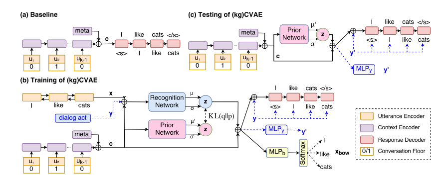

# Self Labeling Conditional Variational Auto Encoder

使用tensorflow实现论文**Improve Diverse Text Generation by Self Labeling Conditional Variational Auto Encoder**
论文链接[paper](https://arxiv.org/abs/1903.10842)

## References 
参考Knowledge-Guided CVAE for dialog generation的tensorflow实现[代码](https://github.com/snakeztc/NeuralDialog-CVAE).

[论文](https://arxiv.org/abs/1703.10960)模型如下：

## Model

## Dataset
 - 对话数据集,同kgCVAE
 - 自动回复聊天数据集

## Prerequisites
 - TensorFlow 1.12.0
 - cuDNN 6
 - Python 2.7
 - Numpy
 - NLTK
 - You may need to pip install beeprint if the module is missing

## Train
    python kgcvae_swda.py

## Test a existing model
Modify the TF flags at the top of kgcvae_swda.py as follows to run a existing model

    forward_only: False -> True
    test_path: set to the folder contains the model. E.g. runxxxx
Then you can run the model by:

    python kgcvae_swda.py
The outputs will be printed to stdout and generated responses will be saved at test.txt in the test_path.

